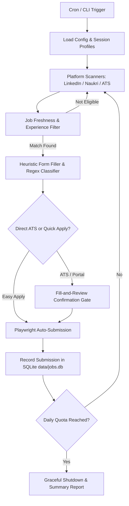

# 🚀 Autonomous Multi-Platform Job Application & ATS RPA Engine

[](https://www.python.org/downloads/)
[](https://playwright.dev/)
[](https://www.sqlite.org/)
[](https://rich.readthedocs.io/)
[](https://opensource.org/licenses/MIT)

An intelligent, scheduled Robotic Process Automation (RPA) engine designed to automate end-to-end job discovery and application workflows across **LinkedIn (Easy Apply)**, **Naukri (Direct Apply)**, and **Enterprise ATS Career Portals** (Workday, Greenhouse, Lever, SmartRecruiters, BambooHR, SuccessFactors, etc.) with persistent authentication, anti-bot stealth, and zero-RAM idle scheduling.

---

## 🏗️ Architecture & Workflow



---

## 🌟 Key Capabilities

- **Persistent 2FA Authentication**: Log in once interactively with 2FA/OTP. Your session cookies and storage state are saved locally in `data/browser_profiles/`. Passwords are never stored in plaintext.
- **Enterprise ATS Support**: Specialized form filling pipelines for:
  - **Workday**: Account registration, credential input, wizard navigation, and step confirmation.
  - **Greenhouse**: Demographic EEO handling, split name normalization, and custom dropdowns.
  - **Lever**: Social URL auto-population (LinkedIn, GitHub, Portfolio) and screening questions.
  - **SmartRecruiters & BambooHR**: Hidden file input resolution and multi-page review flow.
  - **Deloitte / SAP SuccessFactors**: Multi-tier login hierarchy and advisory tab bypass.
- **Intelligent Heuristic Form Filler**:
  - Contextual regular expression classification for notice periods, numeric CTC, years of skill experience, and work authorizations.
  - Candidate metadata isolation (ignores posting age like *"5+ days ago"* and card counts like *"10+ applicants"*).
- **Recruiter Visibility Bump**:
  - Automatically re-uploads your latest resume before applying to keep your profile marked *"Active Today"*, dramatically increasing recruiter search visibility.
- **ACID Relational Deduplication**:
  - Local SQLite database (`data/jobs.db`) permanently tracks job IDs, company names, timestamps, and application statuses to prevent duplicate submissions.
- **Dual Display & Zero-RAM Scheduling**:
  - Run with an interactive visible browser or silent headless background execution.
  - Includes a POSIX crontab script (`run_daily.sh`) that triggers once per day and terminates upon quota limit (uses 0 MB RAM when idle).

---

## 🧰 Tech Stack & Libraries

| Technology | Purpose |
| :--- | :--- |
| **Python 3.10+** | Core runtime, dataclasses, type hinting, and regex engine. |
| **Playwright** | Chromium automation, DOM locators, frame isolation, and stealth emulation. |
| **PyYAML** | Schema validation, YAML parsing, and recursive configuration merging. |
| **SQLite3** | ACID relational storage for application tracking and deduplication. |
| **Rich** | Terminal UI, formatted job tables, spinners, and structured status logging. |
| **Schedule** | In-process timer daemon for continuous automated scheduling. |
| **Linux POSIX Cron** | System-level scheduling with zero background resource consumption. |

---

## 📦 Prerequisites & Installation

### 1. Clone the Repository
```bash
git clone https://github.com/Ansh-mishra2000/job-apply-automation.git
cd job-apply-automation
```

### 2. Set Up a Virtual Environment
```bash
python3 -m venv .venv
source .venv/bin/activate
```

### 3. Install Dependencies
```bash
pip install -r requirements.txt
```

### 4. Install Playwright Browser Binaries
```bash
playwright install chromium
```

---

## ⚙️ Configuration & Document Setup

### Step 1: Copy the Template Configuration
Create your active configuration file from the template:
```bash
cp config.example.yaml config.yaml
```
*(Note: `config.yaml` is ignored by `.gitignore` to keep your personal data completely private on your local machine).*

---

### Step 2: Place Your Resume and Cover Letter

> [!IMPORTANT]
> **Document Format & Location Requirements**:
> 1. **Format**: All documents **MUST be valid PDF (`.pdf`) format**. Word documents (`.docx`) or text files are not accepted by online ATS portals.
> 2. **Resume Location**: Place your resume PDF in the project root directory and name it `resume.pdf` (or set `profile.resume_path` in `config.yaml`).
> 3. **Cover Letter Location**: Place your cover letter PDF in the project root directory named `cover_letter.pdf` (or set `profile.cover_letter_path` in `config.yaml`).

---

### Step 3: Configure `config.yaml` Details

Open `config.yaml` and customize the following key sections:

#### 1. Contact Information
```yaml
profile:
  full_name: "Jane Doe"
  first_name: "Jane"
  last_name: "Doe"
  email: "jane.doe@example.com"
  phone: "9876543210"
  current_city: "Bengaluru"
  country: "India"
  linkedin_url: "https://www.linkedin.com/in/janedoe/"
  github_url: "https://github.com/janedoe"
```

#### 2. Compensation & Notice Period (CRITICAL FORMAT)
```yaml
  # MUST be numeric integers in annual currency.
  # Do NOT use text like "negotiable" or portal validation will fail:
  current_ctc: "600000"           # 6 LPA in INR
  expected_ctc: "1200000"         # 12 LPA in INR

  # Notice period MUST be numeric integer in DAYS:
  notice_period_days: 30          # e.g. 0, 15, 30, 60, 90
```

#### 3. Search Keywords & Locations
```yaml
search:
  keywords:
    - "DevOps Engineer"
    - "Site Reliability Engineer"
    - "Cloud Infrastructure Engineer"
    - "Kubernetes Engineer"
    - "Python Developer"
  locations:
    - "India"
  experience_years: "0-3"
  date_posted: "30d"              # '30d', '15d', '7d', '24h'
```

#### 4. Skill Experience Mapping
Configure specific years of experience per skill for screening questions:
```yaml
  skills_experience:
    aws: 3
    kubernetes: 2
    docker: 3
    terraform: 2
    python: 3
    ci/cd: 3
```

---

## 🖥️ Usage Guide

### 1. One-Time Interactive Login (Account Security)
Run the login command to open browser windows where you can authenticate and solve 2FA/OTP once:
```bash
# Log into both LinkedIn and Naukri
./.venv/bin/python main.py login

# Or individually:
./.venv/bin/python main.py login --platform linkedin
./.venv/bin/python main.py login --platform naukri
```
*Your session cookies will be stored locally in `data/browser_profiles/` for all subsequent runs.*

---

### 2. Search & Inspect Matching Jobs (Without Applying)
Preview live job listings with time-freshness filters before triggering auto-apply:
```bash
# View DevOps Engineer jobs posted in the last 30 days:
./.venv/bin/python main.py list --position "DevOps Engineer" --time 30d

# Inspect fresh jobs posted in the last 24 hours:
./.venv/bin/python main.py list --position "Python Developer" --time 24h

# Search, view table, and immediately auto-apply:
./.venv/bin/python main.py list --position "Site Reliability Engineer" --time 7d --apply
```

---

### 3. Run Applications
Launch the automation to apply across platforms until daily quotas are reached:
```bash
# Interactive mode (prompts for Visible or Background execution):
./.venv/bin/python main.py run

# Explicit visible window (watch the bot in action):
./.venv/bin/python main.py run --visible

# Silent background execution (headless):
./.venv/bin/python main.py run --headless

# Target a specific platform:
./.venv/bin/python main.py run --platform linkedin --visible
./.venv/bin/python main.py run --platform naukri --visible
```

---

### 4. Direct URL Application
Apply directly to any supported career portal or job posting URL:
```bash
./.venv/bin/python main.py apply-url --url "https://jobs.lever.co/company/job-id" --visible
```

---

### 5. Profile Bump (Recruiter Visibility Boost)
Re-upload your resume to job boards to refresh your *"Profile Updated: Today"* badge:
```bash
./.venv/bin/python main.py update-resume
```

---

### 6. View Application Telemetry & Stats
Check daily quota limits and application statistics:
```bash
./.venv/bin/python main.py stats
```

---

### 7. Set Up Automated Daily Cron
Schedule the application to run automatically every morning via Linux `cron`:
```bash
./.venv/bin/python main.py cron-setup
```
Alternatively, add it manually to `crontab -e`:
```cron
30 9 * * * /path/to/job-apply-automation/run_daily.sh --headless
```

---

## 🧪 Running the Test Suite

The codebase includes an extensive 43-test suite covering ATS DOM filling, job filtering, card metadata isolation, and platform stop conditions:

```bash
./.venv/bin/python -m unittest discover -s tests -v
```

---

## 🛡️ Privacy & Security Best Practices

- **Zero Credentials in Git**: Passwords, cookies, session states, and `config.yaml` are strictly ignored by `.gitignore`.
- **Local SQLite Storage**: Your applied job history is stored locally in `data/jobs.db` and is never sent to external servers.
- **Fill-and-Review Mode**: External ATS applications default to `auto_submit: false`, which pauses on the review screen so you can verify answers before submitting.

---

## ⚖️ Disclaimer

This software is developed for **educational, research, and personal automation purposes only**. 
- Users are responsible for complying with the Terms of Service of each respective platform (LinkedIn, Naukri, Workday, etc.).
- The developers assume no liability for account restrictions, rate limits, or misuse of this tool. Always use human-like delays (`human_delay_min` and `human_delay_max`) and respect daily platform limits.

---

## 📄 License

Distributed under the [MIT License](LICENSE).
