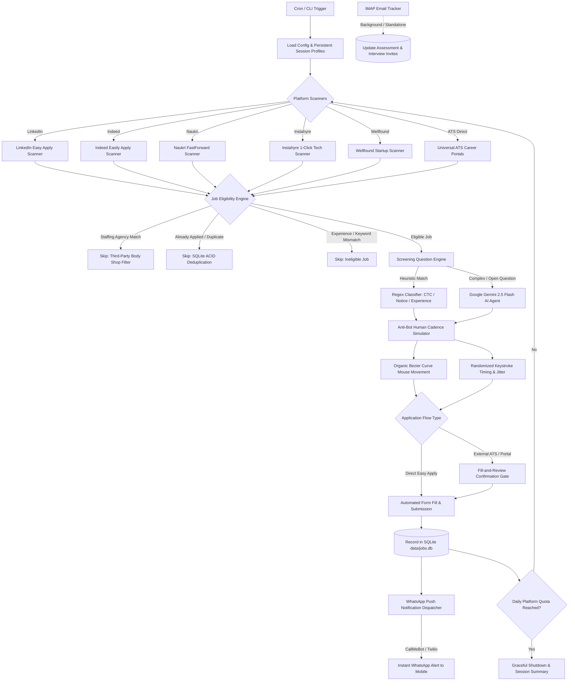

# 🚀 Autonomous Multi-Platform Job Application & ATS RPA Engine

[](https://www.python.org/downloads/)
[](https://playwright.dev/)
[](https://ai.google.dev/)
[](https://www.sqlite.org/)
[](https://rich.readthedocs.io/)
[](https://www.whatsapp.com/)
[](https://opensource.org/licenses/MIT)

An intelligent, scheduled Robotic Process Automation (RPA) and AI-driven recruitment suite designed to automate end-to-end job discovery, screening question resolution, and application submission across **LinkedIn (Easy Apply)**, **Indeed (Easily Apply)**, **Naukri (Direct Apply)**, **Instahyre (1-Click Tech Apply)**, **Wellfound (AngelList Startups)**, and **Enterprise ATS Career Portals** (Workday, Greenhouse, Lever, SmartRecruiters, BambooHR, SuccessFactors).

Engineered with **Google Gemini 2.5 Flash** for dynamic screening questions, **Anti-Bot Human Cadence Simulation** (organic Bezier curves and typing jitter), **Instant WhatsApp Mobile Alerts**, **IMAP Email Lifecycle Tracking**, **Staffing Body-Shop Filtering**, and **zero-RAM idle scheduling**.

---

## 🏗️ Architecture & Workflow


```mermaid
flowchart TD
    A[Cron / CLI Trigger] --> B[Load Config & Persistent Session Profiles]
    B --> C{Platform Scanners}
    C -->|LinkedIn| D1[LinkedIn Easy Apply Scanner]
    C -->|Indeed| D2[Indeed Easily Apply Scanner]
    C -->|Naukri| D3[Naukri FastForward Scanner]
    C -->|Instahyre| D4[Instahyre 1-Click Tech Scanner]
    C -->|Wellfound| D5[Wellfound Startup Scanner]
    C -->|ATS Direct| D6[Universal ATS Career Portals]

    D1 & D2 & D3 & D4 & D5 & D6 --> E{Job Eligibility Engine}
    E -->|Staffing Agency Match| E1[Skip: Third-Party Body Shop Filter]
    E -->|Already Applied / Duplicate| E2[Skip: SQLite ACID Deduplication]
    E -->|Experience / Keyword Mismatch| E3[Skip: Ineligible Job]
    
    E -->|Eligible Job| F[Screening Question Engine]
    F -->|Heuristic Match| G1[Regex Classifier: CTC / Notice / Experience]
    F -->|Complex / Open Question| G2[Google Gemini 2.5 Flash AI Agent]
    
    G1 & G2 --> H[Anti-Bot Human Cadence Simulator]
    H --> H1[Organic Bezier Curve Mouse Movement]
    H --> H2[Randomized Keystroke Timing & Jitter]

    H1 & H2 --> I{Application Flow Type}
    I -->|Direct Easy Apply| J1[Automated Form Fill & Submission]
    I -->|External ATS / Portal| J2[Fill-and-Review Confirmation Gate]
    J2 --> J1

    J1 --> K[(Record in SQLite data/jobs.db)]
    K --> L[WhatsApp Push Notification Dispatcher]
    L -->|CallMeBot / Twilio| L1[Instant WhatsApp Alert to Mobile]

    K --> M{Daily Platform Quota Reached?}
    M -->|No| C
    M -->|Yes| N[Graceful Shutdown & Session Summary]

    O[IMAP Email Tracker] -.->|Background / Standalone| P[(Update Assessment & Interview Invites)]
```

---

## 🌟 Key Capabilities

### 1. Multi-Platform Coverage
- **LinkedIn**: Easy Apply automation, multi-step modal handling, resume auto-selection, and recruiter outreach.
- **Indeed**: "Easily apply" automation, `indeed-apply-iframe` modal navigation, resume upload/switch, and rate-limit backoff.
- **Naukri**: Direct application engine, questionnaire resolution, and automatic daily profile update badge bump.
- **Instahyre**: 1-click curated Indian tech product company applications.
- **Wellfound (AngelList)**: Targeted startup and remote technology job applications.
- **Enterprise ATS Portals**: Native DOM form filling pipelines for **Workday**, **Greenhouse**, **Lever**, **SmartRecruiters**, **BambooHR**, and **SAP SuccessFactors / Deloitte**.

### 2. Google Gemini 2.5 Flash AI Agent
- Resolves non-standard screening questions (e.g. *"Describe your experience with multi-region Kubernetes clusters"*, *"Why are you interested in this role?"*).
- Auto-generates concise, tailored cover letters matching the candidate profile to the exact job description.
- Built using Python's standard library REST client—**zero extra pip dependencies** required.
- Robust fallback: If Gemini is disabled or the API key is absent, the system seamlessly uses contextual regex heuristics.

### 3. Anti-Bot Keystroke & Mouse Trajectory Simulation
- **Organic Bezier Curves**: Mouse movements follow realistic, randomized Bezier trajectories with variable velocity rather than robotic straight lines.
- **Micro-Delays & Key Jitter**: Natural typing cadence (25–90ms per key) with deliberate micro-pauses at whitespace and punctuation.
- **Human Click Offset**: Mouse clicks target varied internal points of interactive elements, avoiding the unnatural geometric center.

### 4. Staffing Body-Shop Exclusion Filter
- Automatically detects and skips third-party recruitment agencies, consultancies, and body shops (e.g., TeamLease, Randstad, Adecco, Kelly Services, Collabera, etc.) based on company name, title patterns, and description indicators, focusing exclusively on direct corporate hirers.

### 5. Instant WhatsApp Mobile Push Notifications
- Real-time alerts sent directly to your personal **WhatsApp** (via free CallMeBot API or Twilio) whenever:
  - A job is successfully submitted (with company, role, location, platform, and total count).
  - A CAPTCHA or 2FA challenge requires human attention.
  - Daily application quotas are achieved.

### 6. Email Recruitment & Assessment Lifecycle Tracker
- Connects securely to your email inbox (e.g., Gmail) via read-only IMAP SSL.
- Cross-references incoming messages with companies you applied to in `data/jobs.db`.
- Classifies emails into **Interview Invitations**, **Coding Assessments / Tests**, **Offers**, or **Rejections**, updating your application database automatically.

### 7. ACID Relational Deduplication & Local Profile Security
- Local SQLite database (`data/jobs.db`) tracks every job ID, platform, URL, company, and submission timestamp.
- Completely prevents duplicate applications across runs.
- Browser cookies and storage states remain strictly on your local machine in `data/browser_profiles/`.

---

## 🧰 Tech Stack & Architecture

| Technology | Purpose | Implementation Details |
| :--- | :--- | :--- |
| **Python 3.10+** | Core runtime | Modern type hints, dataclasses, standard library networking. |
| **Playwright** | Browser automation | Chromium CDP automation, stealth flags, shadow DOM, iframes. |
| **Google Gemini API** | AI screening agent | `gemini-2.5-flash` model via pure Python stdlib REST transport. |
| **SQLite3** | Relational database | ACID transactions, application deduplication, lifecycle status. |
| **Rich** | Terminal UI | Beautiful CLI tables, live spinners, panel logs, color-coded statuses. |
| **PyYAML** | Configuration engine | YAML parsing, schema validation, configuration merging. |
| **WhatsApp** | Real-time alerts | Instant mobile alerts via free CallMeBot API or Twilio Programmable Messaging. |
| **IMAP4 SSL** | Email tracking | Gmail / standard IMAP mail parser for recruitment responses. |
| **Linux POSIX Cron** | Headless scheduling | Zero background memory consumption when idle. |

---

## 📦 Prerequisites & Installation

### 1. Clone the Repository
```bash
git clone https://github.com/Ansh-mishra2000/job-apply-automation.git
cd job-apply-automation
```

### 2. Set Up a Python Virtual Environment
```bash
python3 -m venv .venv
source .venv/bin/activate
```

### 3. Install Dependencies
```bash
pip install -r requirements.txt
```

### 4. Install Playwright Chromium Browser
```bash
playwright install chromium
```

---

## ⚙️ Configuration Guide

### Step 1: Copy the Template Configuration
Create your active configuration file from the template:
```bash
cp config.example.yaml config.yaml
```
*(Note: `config.yaml` is excluded by `.gitignore` so your personal details, credentials, and API keys are never pushed to GitHub).*

---

### Step 2: Place Your Resume and Cover Letter

> [!IMPORTANT]
> **Document Format & Location Requirements**:
> 1. **Format**: All documents **MUST be valid PDF (`.pdf`) format**. Word documents (`.docx`) or text files will fail portal validation.
> 2. **Resume Location**: Place your resume PDF in the project root directory and name it `resume.pdf` (or configure `profile.resume_path` in `config.yaml`).
> 3. **Cover Letter Location**: Place your cover letter PDF in the project root directory named `cover_letter.pdf` (or configure `profile.cover_letter_path` in `config.yaml`).

---

### Step 3: Configure `config.yaml`

Open `config.yaml` and configure your settings:

#### 1. Candidate Profile
```yaml
profile:
  full_name: "Alex Mercer"
  first_name: "Alex"
  last_name: "Mercer"
  email: "alex.mercer@example.com"
  phone: "9876543210"
  current_city: "Bengaluru"
  country: "India"
  linkedin_url: "https://www.linkedin.com/in/alex-mercer/"
  github_url: "https://github.com/alexmercer"
  portfolio_url: "https://alexmercer.dev"
  
  # CRITICAL: Compensation MUST be annual numeric integers without text or commas:
  current_ctc: "800000"          # e.g., 8 LPA in INR
  expected_ctc: "1600000"        # e.g., 16 LPA in INR

  # Notice period MUST be an integer in DAYS:
  notice_period_days: 30         # 0 (immediate), 15, 30, 60, 90
```

#### 2. Skill Experience Mapping
Provide numeric years of experience for screening questionnaires:
```yaml
  skills_experience:
    python: 4
    aws: 3
    docker: 3
    kubernetes: 2
    terraform: 2
    ci/cd: 3
    linux: 4
    sql: 3
```

#### 3. Search Keywords & Job Filtering
```yaml
search:
  keywords:
    - "DevOps Engineer"
    - "Site Reliability Engineer"
    - "Cloud Platform Engineer"
    - "Python Developer"
  locations:
    - "India"
    - "Remote"
  experience_years: "1-4"
  date_posted: "7d"              # '24h', '7d', '15d', '30d'

filter:
  exclude_staffing_agencies: true  # Automatically filter out third-party body shops
  excluded_companies:
    - "CyberCoders"
    - "Revature"
```

#### 4. Google Gemini AI Screening Agent (Optional)
```yaml
ai:
  enabled: true                  # Set to true to enable Gemini dynamic question solving
  api_key: "YOUR_GEMINI_API_KEY" # Or set GEMINI_API_KEY environment variable
  model: "gemini-2.5-flash"
  auto_generate_cover_letters: true
```

#### 5. Instant WhatsApp Mobile Push Notifications (Optional)
```yaml
notifications:
  enabled: true
  whatsapp:
    enabled: true
    # Your phone number with country code (e.g. "+919876543210")
    phone: "+919876543210"
    # Free CallMeBot API key (takes 10 seconds):
    # Send "I allow callmebot to send me messages" to +34 941 83 20 62 on WhatsApp
    api_key: "YOUR_CALLMEBOT_API_KEY"

    # (Optional) Twilio WhatsApp credentials if you prefer Twilio:
    twilio_account_sid: ""
    twilio_auth_token: ""
    twilio_from: "whatsapp:+14155238886"
    twilio_to: ""
```

#### 6. Email Application Tracker (Optional)
```yaml
email_tracker:
  enabled: true
  imap_host: "imap.gmail.com"
  imap_port: 993
  email: "alex.mercer@example.com"
  password: "YOUR_GMAIL_APP_PASSWORD"       # Use Google App Password (not your main password)
  check_days: 7
```

---

## 🖥️ Usage Guide

### 1. One-Time Interactive Login
Authenticate on your selected platforms once to store persistent sessions:
```bash
# Log into all configured platforms interactively:
./.venv/bin/python main.py login

# Or log into a specific platform:
./.venv/bin/python main.py login --platform linkedin
./.venv/bin/python main.py login --platform indeed
./.venv/bin/python main.py login --platform naukri
./.venv/bin/python main.py login --platform instahyre
./.venv/bin/python main.py login --platform wellfound
```

---

### 2. Search & Inspect Matching Jobs (Without Applying)
Preview live listings before applying:
```bash
# Preview DevOps jobs posted in the last 7 days:
./.venv/bin/python main.py list --position "DevOps Engineer" --time 7d

# Search Indeed for SRE roles:
./.venv/bin/python main.py list --platform indeed --position "Site Reliability Engineer" --time 24h

# Preview and apply immediately:
./.venv/bin/python main.py list --position "Python Developer" --apply
```

---

### 3. Run Applications
Launch the automated job application loop across all or selected platforms:
```bash
# Run across all platforms in visible mode:
./.venv/bin/python main.py run --visible

# Run silently in background (headless mode):
./.venv/bin/python main.py run --headless

# Target a specific platform:
./.venv/bin/python main.py run --platform indeed --visible
./.venv/bin/python main.py run --platform linkedin --visible
./.venv/bin/python main.py run --platform instahyre --visible
./.venv/bin/python main.py run --platform wellfound --visible
```

---

### 4. Direct ATS URL Application
Apply directly to any supported career portal URL (Workday, Lever, Greenhouse, etc.):
```bash
./.venv/bin/python main.py apply-url --url "https://jobs.lever.co/company/job-id" --visible
```

---

### 5. Profile Bump (Recruiter Visibility Boost)
Re-upload your resume to job boards to refresh your *"Profile Updated: Today"* badge:
```bash
./.venv/bin/python main.py update-resume
./.venv/bin/python main.py update-resume --platform indeed
```

---

### 6. Verify AI & Notification Integrations
Verify your Gemini AI credentials and push notifications:
```bash
# Test Google Gemini AI connection & answer generation:
./.venv/bin/python main.py test-ai

# Send a test push notification to your personal WhatsApp:
./.venv/bin/python main.py test-notify
```

---

### 7. Track Email Responses & Interviews
Scan your inbox for interview requests, coding assessments, or status updates:
```bash
./.venv/bin/python main.py track-emails
```

---

### 8. View Application Telemetry & Stats
View submission counts and platform quota usage:
```bash
./.venv/bin/python main.py stats
```

---

### 9. Scheduled Daily Automation (Cron)
Configure a daily cron trigger to run headless each morning:
```bash
./.venv/bin/python main.py cron-setup
```
Manual crontab entry (`crontab -e`):
```cron
30 9 * * 1-5 /path/to/job-apply-automation/run_daily.sh --headless
```

---

## 🧪 Running the Test Suite

The codebase includes an extensive 82-test unit suite covering AI answering, anti-bot simulation, agency filtering, platform drivers, WhatsApp notifications, and ATS form engines:

```bash
./.venv/bin/python -m unittest discover tests -v
```

All 81 tests execute cleanly with zero external network calls via isolated mocks.

---

## 🛡️ Privacy & Security Best Practices

- **Zero Credentials in Git**: Passwords, cookies, session states, `data/jobs.db`, resumes, and `config.yaml` are strictly ignored by `.gitignore`.
- **Local SQLite Storage**: Your application records remain entirely private on your own system.
- **Fill-and-Review Safety Gate**: External ATS applications default to review mode so you can inspect generated responses before final submission.

---

## ⚖️ Disclaimer

This software is developed for **educational, research, and personal automation purposes only**.
- Users are responsible for complying with the Terms of Service of each respective platform.
- The developers assume no liability for account restrictions or misuse. Use realistic human delays and respect daily platform limits.

---

## 📄 License

Distributed under the [MIT License](LICENSE).
